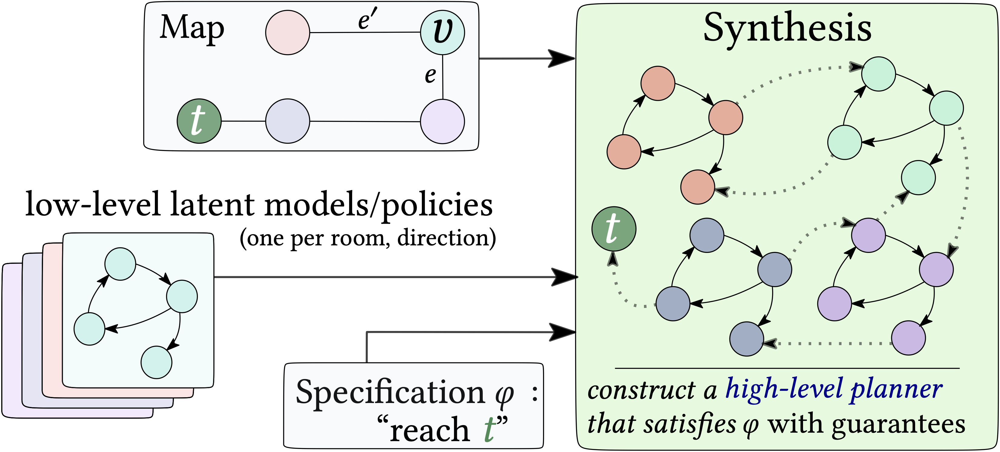

# Composing Reinforcement Learning Policies, with Formal Guarantees
Code for replicating the experiments from the paper [*Composing Reinforcement Learning Policies, with Formal Guarantees*](https://arxiv.org/abs/2402.13785).

## Summary
**This project aims at combining _reinforcement learning_ (RL) and _reactive synthesis_ to equip learning agents with reliable control policies in large, complex environments.**

While **deep RL** is very effective for allowing learning agents to solve complex tasks, (1) it requires (extensive) reward engineering to align the user's intentions with the learned agent's behaviors, and (2) the learned agent's policies are not reliable (no guarantee).
**Reactive synthesis** on the other hand produces reliable control policies that are **guaranteed** to meet *specifications* provided in *intuitive formal language*. However, this requires access to an explicit environment's model, which is rarely possible in complex environments; even when it is, synthesis does not scale to high-stakes scenarios.

This proposed framework tackles those issues through a hierarchical decomposition of the environment into sub-regions/sections that we call "**rooms**".
Given a **graph** (e.g, "map", "skill graph") that represent this decomposition, we apply RL in each room to get low-level policies satisfying low-level specifications.
Then, we apply synthesis to produce a high-level planner that selects which policy to apply in each room. The resulting method provides guarantees on the resulting agent's controller, allows for a separation of concerns, and mitigates reward engineering.

<p align="center">
  
  
</p>

The approach relies on learning **world models** and **discrete latent spaces**, which enables the formal verification of the low-level policies (via model-checking). Reactive synthesis then composes with the low-level RL policies and the world models to produce high-level planners with guarantees. 


## New RL algorithm and environments
The project also includes WAE-DQN, an RL algorithm learning a discrete and verifiable world model along with its policy, and new "two-level" environments:
- [A large, parameterizable grid world with moving obstacles](https://youtu.be/crowN8-GaRg)
- A 8-room [A ViZDoom scenario](https://florentdelgrange.netlify.app/post/composing_rl/video.mp4) with ennemies randomly spawning on the map at regular interval.

The two environments come with low- and high-level variants.
In the low-level variant, the agent is placed in a _room_ of the two-level environment and its goal is to reach the exit safely, by avoiding moving obstacles.
In the high-level variant, the goal of the agent is to navigate safely through the rooms composing the environment to reach a target location.

## Resources
More details can be found in [our paper](https://arxiv.org/abs/2402.13785). See also our [blogpost](https://florentdelgrange.netlify.app/post/composing_rl/).
Videos of synthesized controllers in can be found here:
- [Large grid world](https://youtu.be/crowN8-GaRg)
- [Doom game](https://florentdelgrange.netlify.app/post/composing_rl/video.mp4)
  
## Dependencies
You may find the pip dependencies in the file `requirements.txt`.
Code tested on `python 3.9.6`. 

## Environments
The [Grid world](https://youtu.be/crowN8-GaRg) and [ViZDoom](https://delgrange.me/post/composing_rl/video.mp4) environments described in the paper are available in `reinforcement_learning/environments`.

## Replicating the paper results
### Training WAE-DQN policies
```
cd reinforcement_learning
./train_directions.sh
```
### Train baseline DQN policies
```
cd reinforcement_learning
./train_baselines.sh
```
### Synthesis from WAE-DQN policies
```
./synthesis/synth_doom.sh
./synthesis/synth_pacman.sh
```
### Compute PAC bounds
```
./synthesis/pac_bounds.sh
```
### Pre-trained models
Pre-trained low-level policies can be found in the folder `reinforcement_learning/saves`.

## Cite
If you use this code, please cite it as:
```
@inproceedings{
  DALSNP2025composing,
  title={Composing Reinforcement Learning Policies, with Formal Guarantees},
  author={Florent Delgrange and Guy Avni and Anna Lukina and Christian Schilling and Ann Nowe and Guillermo Perez},
  booktitle={Proceedings of the 24th International Conference on Autonomous Agents and Multiagent Systems, Detroit, Michigan, USA, May 19-23, IFAAMAS},
  year={2025},
}
```
